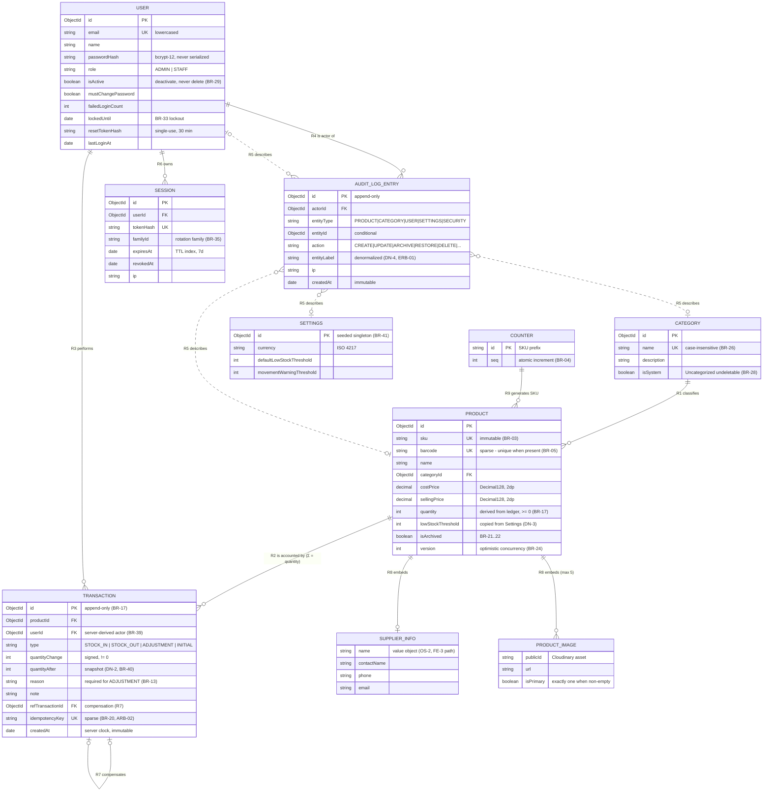

# Entity Relationship Diagram (ERD)

## Web-Based Inventory Management System

| | |
|---|---|
| **Document ID** | ERD-IMS-003 |
| **Version** | 1.0 (Approved) |
| **Date** | 2026-07-22 |
| **Status** | **APPROVED FOR DATABASE DESIGN** |
| **Source of truth** | SRS-IMS-001 (`01-SRS.md`) · ARC-IMS-002 (`02-System-Architecture.md`) — this document conforms to both and never overrides them |
| **Level** | Conceptual / logical — physical MongoDB design follows in the Database Design document |
| **Prepared by** | Lead Software Architect · validated by Senior Database Architect review |

---

## Table of Contents

1. [Design Basis & Conventions](#1-design-basis--conventions)
2. [Entity Catalog](#2-entity-catalog)
3. [Relationships](#3-relationships)
4. [ERD Diagram](#4-erd-diagram)
5. [Embedding vs Referencing Rationale](#5-embedding-vs-referencing-rationale)
6. [Denormalization Register](#6-denormalization-register)
7. [Review Refinements & Findings](#7-review-refinements--findings)
8. [Requirements Coverage](#8-requirements-coverage)
9. [Assumptions, Open Decisions & Risks](#9-assumptions-open-decisions--risks)
10. [Database Design Phase Handoff](#10-database-design-phase-handoff)

---

## 1. Design Basis & Conventions

- **Normative input:** SRS §10 defines the collections; this ERD formalizes their entities, identity, relationships, and integrity semantics. Any deviation discovered downstream is an SRS-change request, never a silent fix (ARC §12).
- **Notation:** crow's-foot text notation — `──<` many side · `│` one side · `( )` optional participation · `◆` composition (value object) · `∎` append-only/immutable · `UQ` unique · `ci` case-insensitive · `sp` sparse (unique when present).
- **No new business entities** were introduced. The only classification decisions are two *value objects* (SupplierInfo, ProductImage), both following the SRS's own embedded definitions (§10.3).
- **No many-to-many relationships exist** in the model — correct by requirement: flat taxonomy (BR-26), one category per product.

---

## 2. Entity Catalog

### 2.1 Core business entities

| Entity | Identity | Purpose | Key attributes (conceptual) | Traces to |
|---|---|---|---|---|
| **User** | Email (business) · surrogate ID (system) | An operator; permanent — deactivated, never deleted, so all history resolves forever | name, email, role {Admin, Staff}, active flag, credential state (password hash, lockout, reset token), last login | SRS §10.1, BR-29…35 |
| **Category** | Name (UQ, ci) | Flat classification of products; includes the permanent system member **Uncategorized** | name, description, system flag | §10.2, BR-26…28 |
| **Product** | SKU (business, immutable) · surrogate ID | A catalog item and holder of *current* stock; quantity is a derived materialization of its ledger | name, SKU, barcode (UQ sp), description, cost/selling price, quantity (derived, ≥ 0), low-stock threshold, archived flag, concurrency version | §10.3, BR-01…10, 21…25 |
| **Transaction** | Surrogate ID · **append-only ∎** | One immutable ledger entry per Stock Movement; collectively the source of truth for quantity: `product.quantity == Σ ledger` (BR-17) | type {STOCK_IN, STOCK_OUT, ADJUSTMENT, INITIAL}, signed quantity change, quantity-after snapshot, reason code, note, idempotency key (UQ sp), server timestamp | §10.4, BR-17…20 |
| **AuditLogEntry** | Surrogate ID · **append-only ∎** | Who changed *non-stock* state: catalog/user/settings mutations and security events, with before/after diffs | entity type, action, changes[], entity label (ERB-01), source IP, server timestamp | §10.6, FR-TXN-04/05 |

### 2.2 Supporting entities

| Entity | Identity | Purpose | Traces to |
|---|---|---|---|
| **Session** (refresh token) | Token hash | Server-side session state enabling rotation, revocation, and reuse detection; grouped into rotation *families*; expires via TTL | §10.5, BR-35 |
| **Settings** | Singleton | System configuration: currency, default low-stock threshold, movement warning threshold; seeded — must always exist | §10.7, BR-41 |
| **Counter** | Prefix string | Technical sequence source for SKU auto-generation (atomic increment) | §10.8, BR-04 |

### 2.3 Value objects (deliberately *not* entities)

| Value object | Lives on | Why not an entity | Traces to |
|---|---|---|---|
| **SupplierInfo** {name, contactName?, phone?, email?} | Product (0..1) | No supplier lifecycle, identity, or cross-product sharing exists in v1 (OS-2). Owned value object per the SRS's embed decision; promotion to a referenced `suppliers` entity is the documented FE-3 migration path | §10.3, FE-3 |
| **ProductImage** {publicId, url, isPrimary} | Product (0..5, exactly one primary when non-empty) | No meaning or lifecycle outside the owning product; Cloudinary holds the binary; hard delete cascades destruction (BR-23/38) | §10.3, BR-36…38 |

---

## 3. Relationships

| # | Relationship | Cardinality | Participation | Semantics & rules |
|---|---|---|---|---|
| R1 | Category **classifies** Product | 1 : N | Product: mandatory (exactly one category) · Category: optional | Category deletion blocked while any product — active *or archived* — references it; reassignment (default Uncategorized) is atomic (BR-27/28) |
| R2 | Product **is accounted by** Transaction | 1 : N | Transaction: mandatory · Product: optional | **The defining relationship:** Product.quantity ≡ Σ R2 signed quantities (BR-17). Zero-R2 products are exactly the hard-deletable set (BR-23); archive never detaches R2 |
| R3 | User **performs** Transaction | 1 : N | Transaction: mandatory (server-derived actor, BR-39) · User: optional | Attribution is permanent — guaranteed by BR-29. Every Transaction type has a human actor (INITIAL = the creating Admin; the reconciliation job only reads) |
| R4 | User **is actor of** AuditLogEntry | 1 : N | Entry: mandatory · User: optional | Same permanence guarantee; also answers "who created a user" without a `createdBy` field |
| R5 | AuditLogEntry **describes** {Product \| Category \| User \| Settings} | N : 1 (polymorphic) | Entry: conditional (some security events reference no entity) | Entity type + reference + diffs; rendering after hard deletes guaranteed by the ERB-01 entity label |
| R6 | User **owns** Session | 1 : N | Session: mandatory | Rotation families; revoked on logout, password change, deactivation, demotion, and reuse detection (BR-35, FR-USER-04) |
| R7 | Transaction **compensates** Transaction | 1 : 0..1 (self-ref) | Optional both ends | Compensating Adjustments reference the original entry; originals never change (BR-17) |
| R8 | Product **owns** SupplierInfo / ProductImage | 1 : 0..1 / 1 : 0..5 | Optional | Composition — value objects cannot outlive the product |
| R9 | Counter **generates** Product SKU | 1 : N (technical) | — | Per-prefix atomic sequence (BR-04); no runtime reference retained on the product |

**Settings** participates in no structural relationship. Its defaults (low-stock threshold) are **copied at product creation**, not referenced — per-product thresholds intentionally survive later settings changes.

---

## 4. ERD Diagram

### 4.1 Text Notation (crow's-foot)

```text
                                ┌───────────────┐
                                │   SETTINGS    │  (singleton — no structural
                                └───────────────┘   relationships; seeds defaults)

┌────────────┐  R1 classifies   ┌──────────────────────────┐
│  CATEGORY  ││───────────────<(│         PRODUCT          │
│ name (UQ,  │  1 : N           │ sku (UQ, immutable)      │
│ ci) ·      │  delete blocked  │ barcode (UQ, sp)         │
│ isSystem   │  while referenced│ quantity (derived, ≥0)   │
└────────────┘                  │ prices · threshold ·     │
                                │ archived · version       │
       ┌────────────────────────│  ◆ SupplierInfo (0..1)   │
       │      R9 generates      │  ◆ ProductImage (0..5)   │
┌──────┴─────┐   (technical)    └───────────┬──────────────┘
│  COUNTER   │                             (│) R2 is accounted by · 1 : N
└────────────┘                              │  Σ(entries) ≡ quantity  [BR-17]
                                ┌───────────▼──────────────┐
                                │       TRANSACTION        │──┐ R7 compensates
                                │ type · Δqty (signed) ·   │  │ 0..1 self-ref
                                │ qtyAfter · reason ·      │◀─┘
                                │ idempotencyKey (UQ, sp)  │   append-only ∎
                                └───────────▲──────────────┘
                                            │ R3 performs · 1 : N
┌──────────────┐  R6 owns · 1 : N  ┌────────┴───────┐
│   SESSION    │>──────────────────│      USER      │
│ tokenHash ·  │  rotation family  │ email (UQ) ·   │
│ familyId ·   │  TTL-expired      │ role · active  │
│ expiresAt    │                   │ (never deleted)│
└──────────────┘                   └────────┬───────┘
                                            │ R4 is actor of · 1 : N
                                ┌───────────▼──────────────┐
                                │      AUDIT LOG ENTRY     │   append-only ∎
                                │ entityType · action ·    │
                                │ changes[] · entityLabel ·│
                                │ ip                       │
                                └───────────┬──────────────┘
                                           (│) R5 describes (polymorphic)
                                            ▼
                              { PRODUCT | CATEGORY | USER | SETTINGS }
```

### 4.2 Rendered Diagram (Mermaid)

Renders visually in VS Code Markdown Preview and on GitHub. Embedded value objects (SupplierInfo, ProductImage) are drawn as separate boxes only so their attributes are visible — physically they live *inside* the Product document (§5). SETTINGS has no solid structural edge by design — its defaults are copied at product creation (DN-3), not referenced. Dashed edges are the polymorphic R5.



---

## 5. Embedding vs Referencing Rationale

| Data | Approach | Why |
|---|---|---|
| SupplierInfo → Product | **Embed** | No independent lifecycle/identity/sharing in v1 (OS-2); always read with its product; FE-3 migration path documented |
| ProductImage → Product | **Embed** | Bounded (≤ 5); composition semantics (cascade destroy, BR-23/38); never queried independently |
| Product → Category | **Reference** | Shared, independently mutable; deletion rules (BR-27) require reference counting |
| Transaction → Product / User | **Reference** | Unbounded 1:N (500k ledger rows, NFR-12); embedding would breach document bounds and violate append-only isolation; referenced entities are guaranteed resolvable (archive/deactivate lifecycles) |
| AuditLogEntry → actor / entity | **Reference** + diff payload + label | Unbounded, append-only; diffs and ERB-01 label make entries permanently self-describing |
| Session → User | **Reference** | Independent TTL lifecycle; security-critical isolation |
| Settings defaults → Product | **Copy at creation** | Deliberate snapshot semantic — per-product thresholds survive later settings changes |

**Document-size safety:** the largest document (Product with 5 image subdocuments + supplier) is ~2 KB with no growth vector; **no unbounded embedded arrays exist anywhere in the model.**

---

## 6. Denormalization Register

The model is normalized except four deliberate, annotated denormalizations — each with its invariant-preserving mechanism:

| # | Denormalization | Preserving mechanism | Driver |
|---|---|---|---|
| DN-1 | `Product.quantity` materializes the R2 ledger sum | Single-writer MovementService + atomic transactions + scheduled reconciliation | BR-17/18/19 |
| DN-2 | `Transaction.quantityAfter` snapshots post-movement stock | Written inside the same transaction; immutable thereafter | BR-40 reproducibility |
| DN-3 | Threshold copied from Settings at product creation | Intentional snapshot; per-product override is the feature | FR-SET-01, B4 |
| DN-4 | `AuditLogEntry.entityLabel` snapshots the subject's display identity | Written at entry creation; immutable | ERB-01 (rendering after hard deletes) |

**No product-name snapshot on Transaction** — deliberately: any product with a Transaction can only be Archived (BR-21), so R2 references always resolve; duplicating names into 500k ledger rows would be waste.

---

## 7. Review Refinements & Findings

Applied during the two-stage review (Lead Architect review; Senior Database Architect technical validation):

| ID | Finding | Resolution |
|---|---|---|
| **ERB-01** (Medium) | R5 references can dangle after hard deletes (BR-23) and category deletes (BR-27), leaving Audit Trail rendering dependent on fragile diff reconstruction | AuditLogEntry gains denormalized **`entityLabel`** (product name+SKU / category name / user email, captured at write time) — DN-4 |
| **DBV-01** (Medium) | FR-SRCH-02 requires case-insensitive **substring** search; a MongoDB text index cannot provide it (word-stem matching) and B-trees serve anchored prefixes only | Recorded as open decision **D-1** for Database Design: primary — **Atlas Search index** (edge-gram) over name/SKU/barcode (managed, already-mandated platform); fallback — normalized lowercase fields with anchored-prefix regex, or a bounded scan of ≤ 10k active products proven against NFR-01 in the NFR-08 load test |
| **DES-1** (Constraint) | MongoDB cannot structurally forbid updates to append-only collections | Enforcement is service-layer + no-mutation-routes + review checklist; reaffirmed as a named deliverable of the Database Design document |

Validation confirmations (no change required): no M:N accidents; no attribute misplacements (lockout on User; idempotency key on Transaction; `quantityAfter` stored not recomputed); no redundant entities; Dashboard statistics correctly *not* persisted (ledger-derived, BR-40); collation dependency of the category-name unique index noted for Database Design.

---

## 8. Requirements Coverage

| Business process | ERD support |
|---|---|
| Authentication / sessions | User credential state + Session (R6, families, TTL) — BR-32…35 |
| Role-based access control | User.role + population constraint: ≥ 1 active Admin (BR-30) |
| Product management | Product + R1 + value objects + lifecycle attributes (archived, version) |
| Category management | Category + R1 blocking/reassignment semantics |
| Supplier information | SupplierInfo value object (v1 scope per OS-2; FE-3 promotion path) |
| Stock In / Stock Out / Adjustments | Transaction types + R2/R3 + idempotency key + reason codes |
| Transaction history | Append-only ledger + `quantityAfter` + R7 compensations |
| Dashboard analytics | Aggregations over Product + Transaction (runtime-cached, not persisted) |
| Barcode / QR operations | Product.barcode (UQ sp) + SKU lookup precedence (BR-06) |
| Reporting | Ledger-derived (BR-40); Consistency report = R2 aggregate vs DN-1 |
| Audit logging | AuditLogEntry + R4/R5 + diffs + DN-4 label + security events |

Consistency verified against SRS FRs, user flows (§8), business rules (BR-01…41), and the System Architecture (single-writer rule, ARB-02 idempotency backstop, A-1 write concern, TTL) — **no inconsistency with either approved document.**

---

## 9. Assumptions, Open Decisions & Risks

**Assumptions (carried, unchanged):** A-1…A-7 (ARC-IMS-002 §9) · AS-1…AS-20 (SRS §21) · DES-1 (above).

**Open decisions for Database Design:** **D-1** — search index mechanism (Atlas Search recommended; fallback documented).

**Risks (carried into Database Design):**

| ID | Risk | Mitigation |
|---|---|---|
| R-2 | Hot-product movement contention (compounded by A-1 majority writes) | Keep movement-path index count minimal; NFR-08 load test gates |
| R-5 | Audit-trail polymorphic query plans at volume | §10.6 compound indexes; verify plans in NFR-08 |
| R-6 | Atlas Search availability/behavior varies by tier (if D-1 primary chosen) | Verify on target tier in Phase 0 alongside ARB-01 proxy verification |

---

## 10. Database Design Phase Handoff

1. Realize SRS §10 **field-for-field**, adding only: DN-4 `entityLabel`, the D-1 decision with rationale, and physical annotations (collation, TTL, sparse, `Decimal128`, `version` token).
2. Deliver the **index catalog mapped to §12 endpoints** with expected plan shapes — makes SCA-02's no-collection-scan criterion mechanically checkable.
3. Add **JSON-schema validators** per collection alongside Mongoose (BR-10 defense-in-depth): enums, `quantity ≥ 0`, required fields.
4. Specify **per-operation transaction boundaries and write/read concern** (movement, archive, category delete, last-admin) — ratifies A-1 in context.
5. Include the **seed specification** (first Admin, Settings singleton, Uncategorized) — BR-28/41 preconditions are part of the data design.
6. Reaffirm **DES-1** with a named enforcement checklist (no mutation routes for `transactions`/`auditLogs`, service-layer guard, review rule).
7. Define the **collation usage rule** for category-name queries so the unique index is actually used.

---

*End of document — ERD-IMS-003 v1.0 · Approved for Database Design · 2026-07-22*